# Analysis of Ironhack Payments by cohorts

## **Introduction**

IronHack Payments, is a financial services company has been offering innovative cash advance solutions since its inception in 2020. With a commitment to providing free cash advances and transparent pricing, IronHack Payments has achieved a substantial user base. As part of its ongoing effort to improve its services and understand user behavior, IronHack Payments has commissioned a cohort analysis project.


## **Data Collection and Data Cleaning**

As a retrorespective study, the study has been provided with two datasets:
  1. Extract of cash requests (project_dataset\extract - cash request - data analyst.csv)
  2. Extract of fees (project_dataset\extract - fees - data analyst - .csv)

  *For description of columns, please check the glossary file (project_dataset\Lexique - Data Analyst.xlsx)
### - Overview of Raw Datasets

We have created heatmaps to visualizae the null data in each dataset - cash request(Figure 1) and fees (figure 2), *red* marks cells with null data while *green* marks those with values. At this stage, our focus is to analyze the meaning and impact of each collection of data thus engage with the next step of data cleaning. 


<p align="center"><b>Figure 1</b>

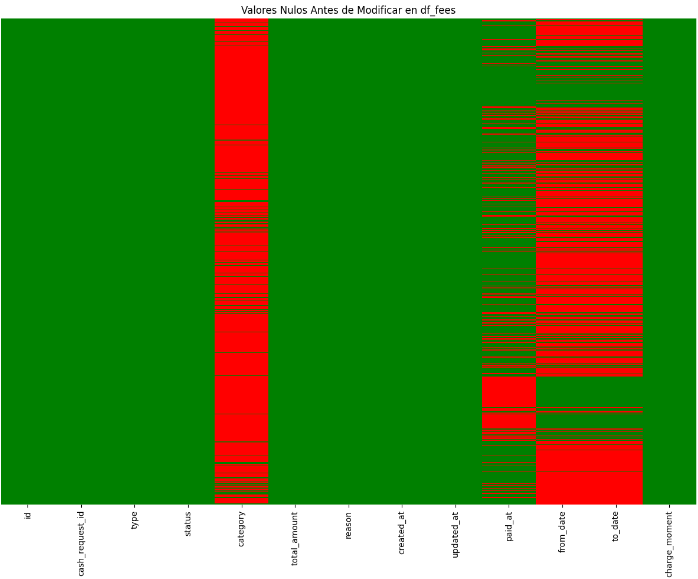
<p align="center"><b>Figure 2</b>

### - Data Types

Both datasets contain object and integer types of data, in order to facilitate furture analysis, we have transformed datas with the date&time format into datatime type in Python. The operation shows as following:

                df_fees[["created_at", "updated_at", "paid_at", "from_date", "to_date"]] = 
                    df_fees[["created_at", "updated_at", "paid_at", "from_date", "to_date"]].apply(pd.to_datetime, format="ISO8601")

### - Data Cleaning

Handling Missing Values:

To address missing data in the above datasets, we have developed a strategy of replacing the empty cells with relevant data accordingly. As for cash request dataset, we have imputed the combination of 'status' and 'transfer_type' into the missing cells; and for fees dataset, missing cells are filled in depending on its 'type' and 'category' - if the missing cell is missing due to unapplicable condition, the cell is filled in with "not applicable"

For detailed imputation process, please check *[NoteBooks\3_DataCleaning.ipynb]*


## **Exploratory Graphic Analysis for Cash Request Dataset**

- Summary Statistics

    Dataset has in total 23970 rows, representing users who had requested cash with IronHack Paymnets from 2019-11-19 until 2020-11-01.
    2020-10 has the most users who made their 1st transaction with the company. 
    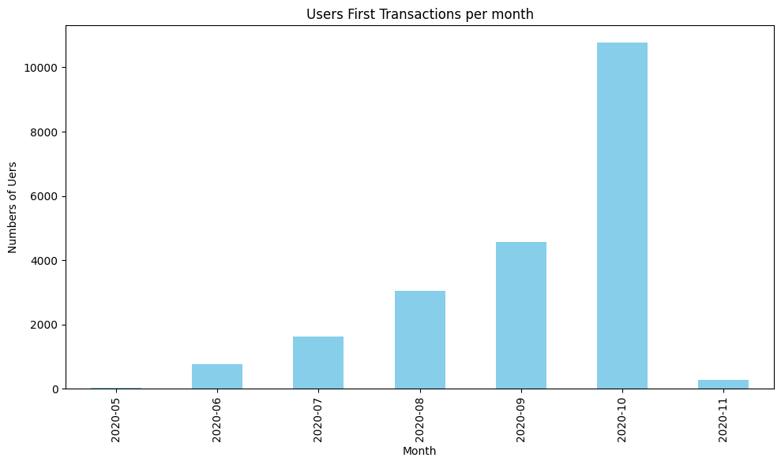

- Distribution Plots

    - Distrubution of Different Status of Cash Request Types
    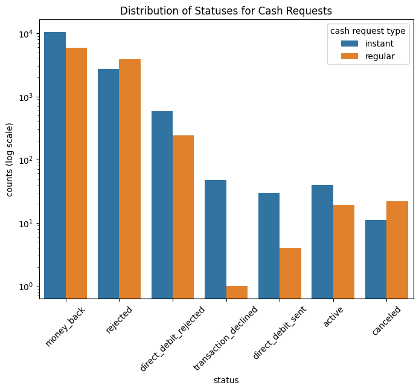

    - Line Chart for Request Frequency per Month
    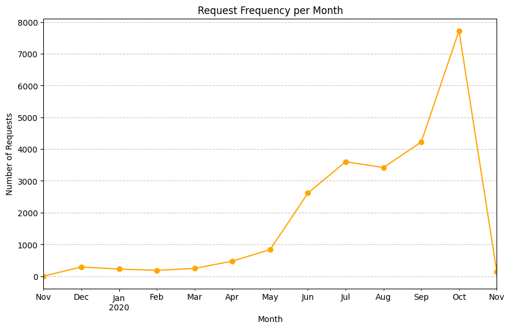


## **Exploratory Graphic Analysis for Fees Dataset**

- Summary Statistics
    
    Dataset has in total 21061 rows, representing the fees added per cash request, from 2020-05-29 until 2021-02-10.
    4 fees have missed data in cash_request_id;
    1 fee is 10 euros while the rest are 5 euros fixed fee;

- Distribution Plots

    - Bar Plot of Fee types
    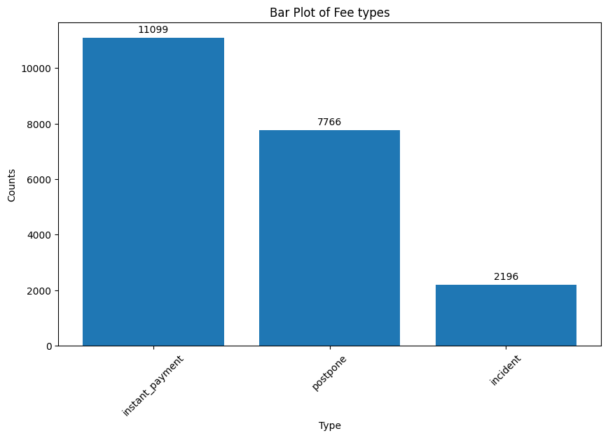

    - Distribution of Fee Status
    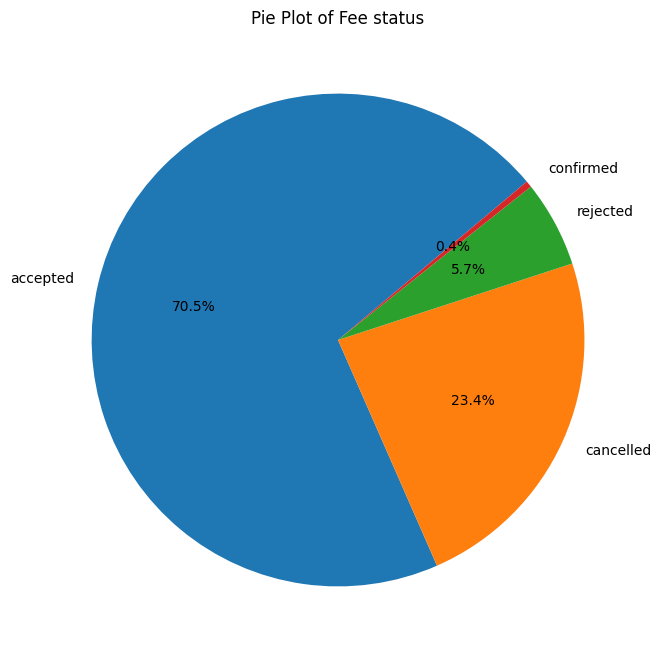

    - Fees Transaction Frequency by Started_Date
    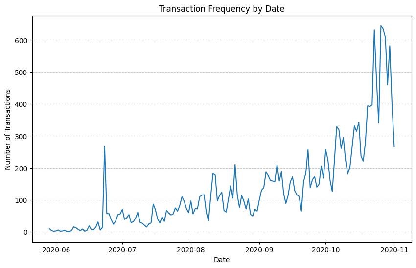

    - Proportion of Fees Transaction Categories
    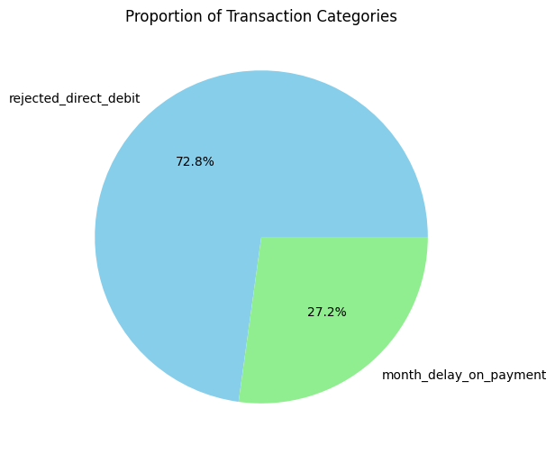


## Visualizations of Relation between Two Datasets

- Charts and graphs

    - Comparison of Fee Transaction and Cash Request Status
    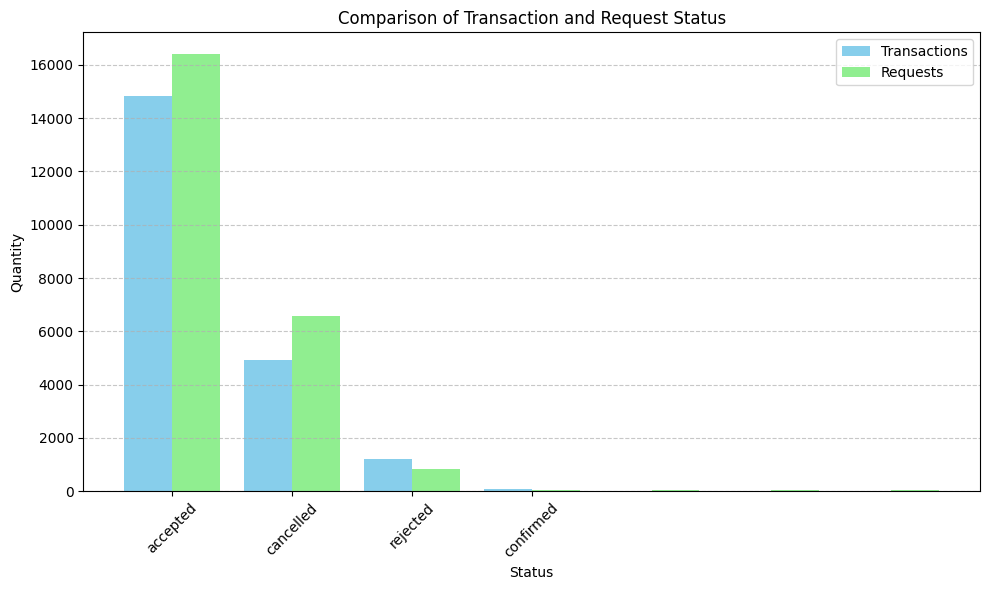

    - Comparison of Fee Transaction and Cash Request Frequency per Month
    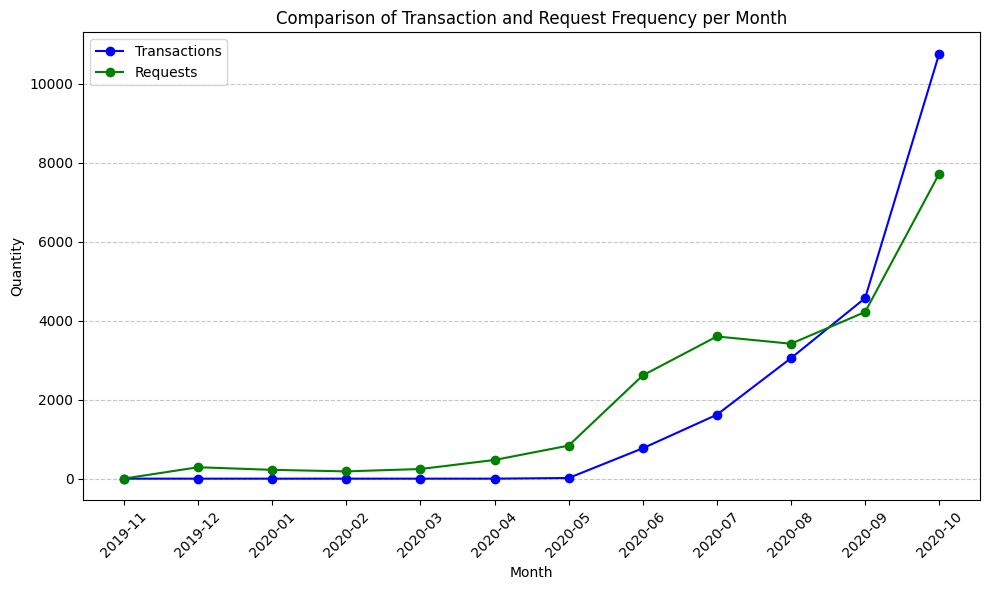


# *Metrics analysis
This part provides an analysis of customer in different rates for Ironhack's payment services from November 2019 to November 2020. The analysis is based on a cleaned dataset stored in a designated folder, which is used for calculating and examining various metrics.

## 1.Retention rate
### Retention Rate Analysis

The purpose of this analysis is to determine the retention rate of different customer groups. The retention rate is defined as the percentage of users who continue using Ironhack's payment services over the specified period. The customer groups are categorized based on the month the user made their first cash request from novembre 2019-2020.


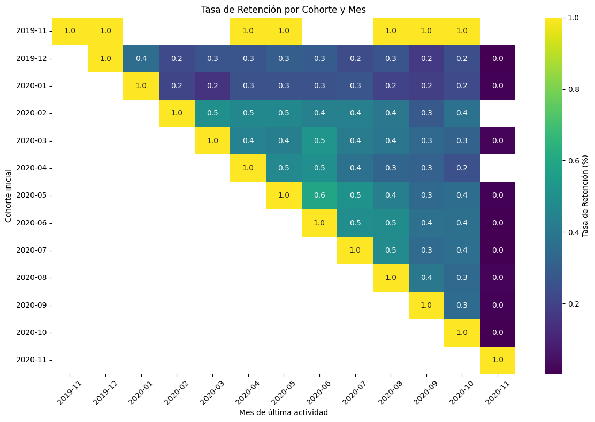

### Key Observations
1. **Retention and Acquisition Rates**:
   - The horizontal rows in the table explain the retention rate.
   - The diagonal entries represent the acquisition rate.

2. **Retention Rate by Cohort**:
   - The analysis reveals that short-time users exhibit a higher retention rate compared to the initial users analyzed.

3. **Increased Activity**:
   - A notable increase in activity was observed during the months of June, July, and August.
   - Further investigation is required to identify the factors that contributed to this surge in activity during these months.

### Conclusion

This analysis helps in understanding the retention dynamics of different customer groups and highlights periods of increased user engagement. The findings can be used to inform strategies aimed at improving customer retention and identifying potential drivers of user activity.

## 2.Incident rate
### Incident Rate Analysis

The purpose of this analysis of the incident rate is fee-relate issues encountered during cash requests within Ironhack's payment services. The analysis aims to understand the types and frequency of incidents and their correlation with cash request volumes.
Incidents in this context refer to issues such as rejected direct debits or delays in monthly payments.

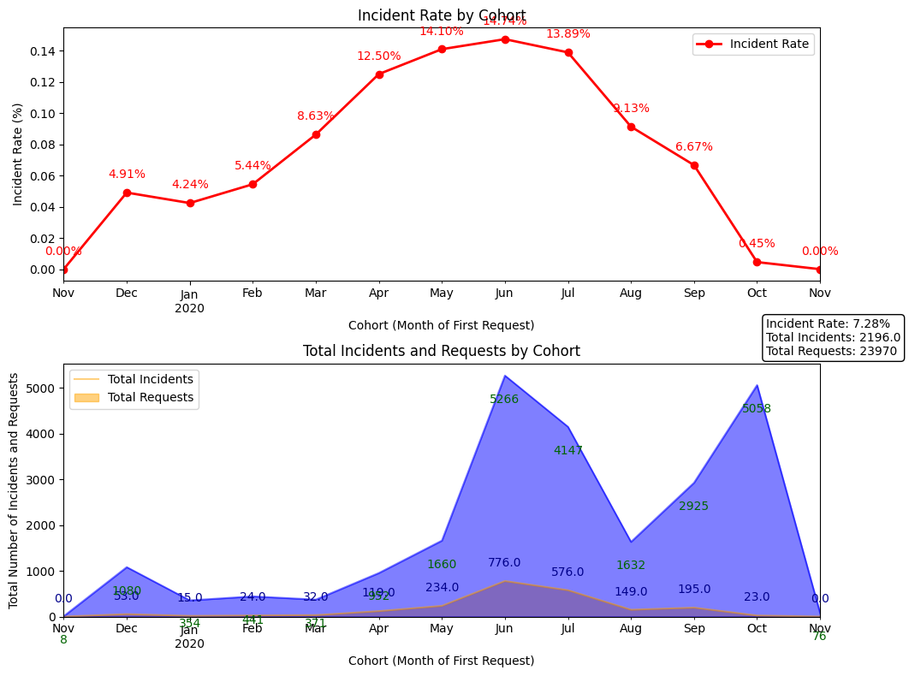

### Key Observations

1. **Incident Rate Trends**:
   - The incident rate is depicted on the first line diagram, showing the relationship between the number of cash requests and the frequency of incidents.
   - Initially, the incident rate increases in proportion to the number of cash requests until August.

2. **August Trend Reversal**:
   - In August, despite an increase in cash request demand, there is a noticeable decrease in incidents.
   - This decline in incidents amidst rising demand suggests that changes were made to reduce the incidents.
   
   the software or increased efforts were undertaken to mitigate incident occurrences as an examples.(esto nose)

3. **Heatmap Analysis**:
   - The same trend can be detected in the heatmap, which shows the increment of incidents in the first month.
   - The heatmap visualizes the distribution and intensity of incidents over time, highlighting june,july and august.After then the incidents fall while the cash request increases.


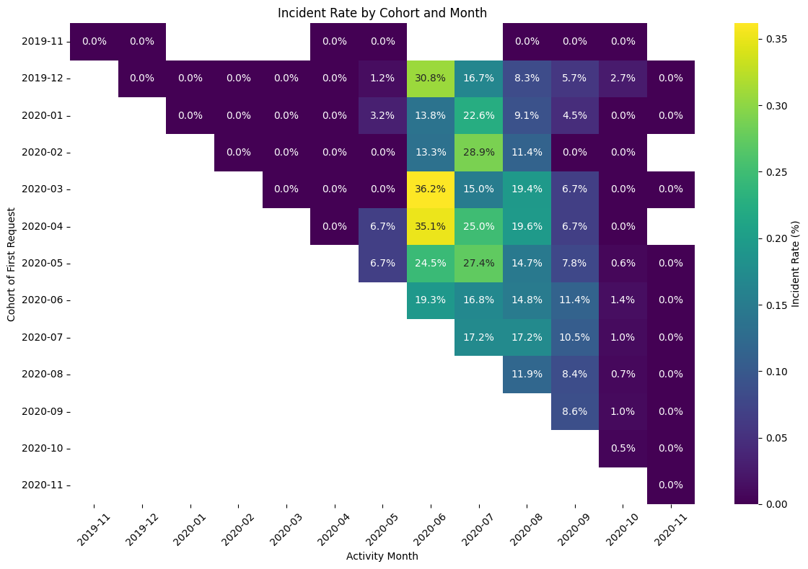

### Conclusion

The initial impression of the analysis would indicate a direct correlation between the volume of cash requests and the incident rate. However, upon further examination, it shows that they are not correlated, as incidents decrease while cash requests increase.

## 3.Income by cohort
### Revenue Analysis

This analysis provides an in-depth analysis of the revenue generated from Ironhack's payment services. We have defined revenue as the commissions with a status of "accepted" and "confirmed" to exclude invalid data.The aim of this analysis is to understand the activity of different cohorts, identify trends, and pinpoint key moments of revenue generation.

· To filter the desired data, we used the following code:
```python
fees_df = fees_df[~fees_df['status'].isin(['rejected', 'cancelled'])]
```
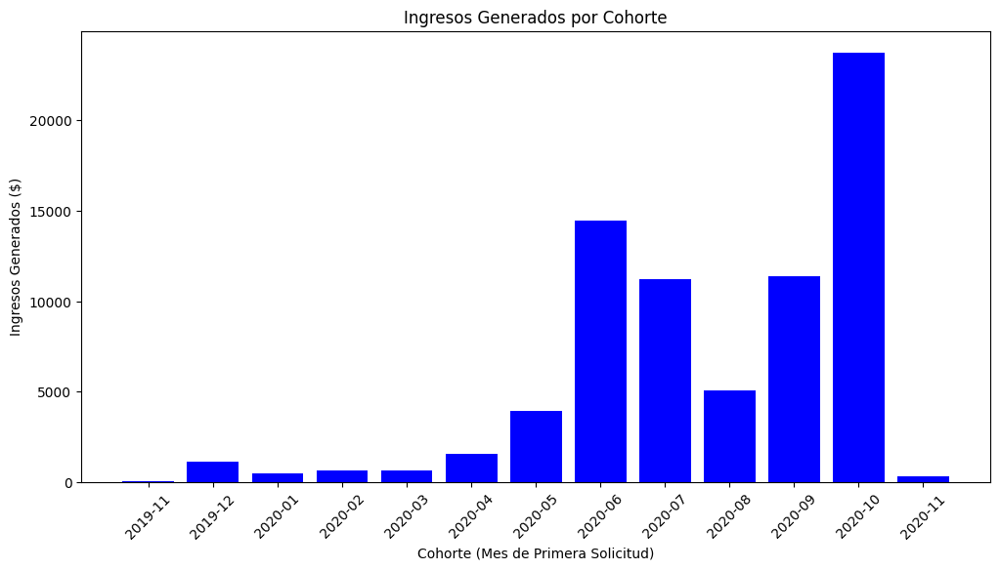

### Key Observations from the Bar Chart

- **Notable revenue results in June 2020 and October 2020.**
- **Significant decline in August 2020.**
- **Very low volume from November 2019 to April 2020, due to the lack of commission implementation.**

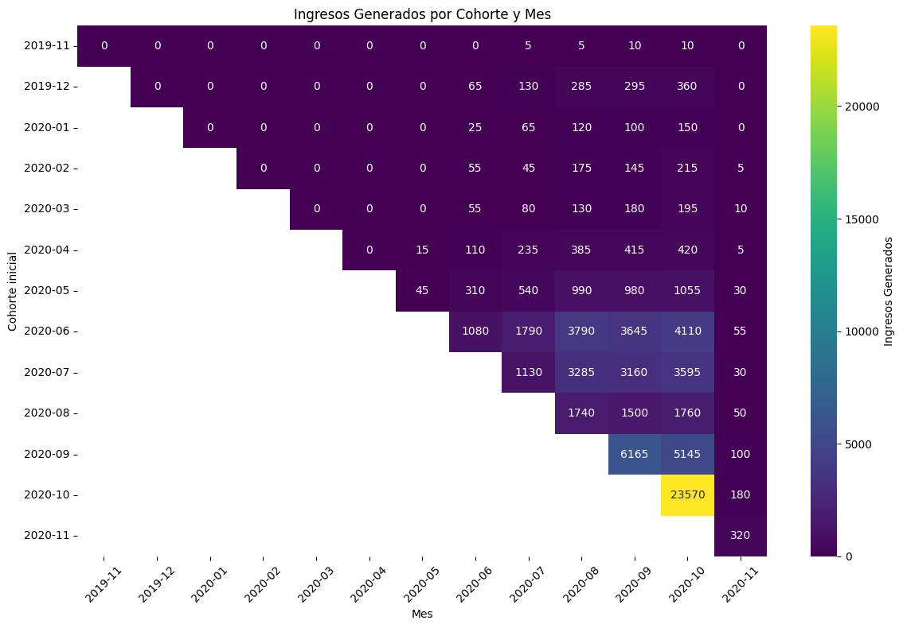

### Heatmap Analysis

To delve deeper, we created a heatmap representing the revenue movement generated by each cohort per month:

1. **Overall Trend**:
   - There is a general increase in revenue, with most cohorts showing growth in their earnings.

2. **High-Revenue Cohorts**:
   - Cohorts from June 2020, July 2020, and September 2020 have notably high revenues. Identifying the users in these cohorts is crucial as they are loyal customers with significant value.

3. **Significant Growth in May 2020 Cohort**:
   - The May 2020 cohort has an even point where the fees start generating income.

4. **Significant Period**:
   - The income starts increasing in August after a decline, reaching its maximum value in October and generating the highest income.

### Correspondence with Incident Rate

The revenue graph aligns with the increased activity shown in the incident rate table, where activity is compared with the number of incidents.

### Conclusion

This analysis highlights the importance of tracking cohort-specific revenue and understanding the factors driving their performance. Identifying key cohorts and their characteristics can help in strategizing for better customer retention and revenue growth.

## 4.New metric TBC

## **Insights and Findings**

- Key findings

- Anomalies and patterns

- Potential actions


## **Conclusion**

- Summary

- Next steps


## **Appendix**

*session 1 - 4th May*

- crear organization in github
- study the raw data and understand the dataframes -> flowchart of cash request, fee&reimbursement created
- create Trello board to notedown tasks (https://trello.com/b/LRPUSwtH/ironhack-firstproject)
- EDA
    1. Exploratory Graphical Analysis for df_fees;
        *e.g. 'Distribution of type of fees', 'Number of Transactions by Status', 'Transaction Frequency by Date', 'Proportion of Transaction Categories'*
    2. Exploratory Graphical Analysis for df_cash_request;
        *e.g. 'Distrubution of cash requests status by types', 'Request Frequency per Month'*
    3. Exploratory Graphical Analysis of Relationship between both DataFrames.
        *e.g. 'Comparison of Transaction and Request Status', 'Comparison of Transaction and Request Frequency per Month'*


*session 2 - 7th Mayo*

- data cleaning -> investigate null data and fill in/drop accordingly
- define cohort -> first transaction month
- calculate cohort 'retention rate' by month

*session 3 - 9th Mayo*

- correct calculation of 'retention rate'
- fill in Null value in heatmap
- investigate rare date -> fees status 'cancelled' & "paid"; transaction "send_at" after "received_date" 