# Analysis of Ironhack Payments by cohorts

## **Introduction**

IronHack Payments, is a financial services company has been offering innovative cash advance solutions since its inception in 2020. With a commitment to providing free cash advances and transparent pricing, IronHack Payments has achieved a substantial user base. As part of its ongoing effort to improve its services and understand user behavior, IronHack Payments has commissioned a cohort analysis project.


## **Data Collection and Data Cleaning**

As a retrorespective study, the study has been provided with two datasets:
  1. Extract of cash requests (project_dataset\extract - cash request - data analyst.csv)
  2. Extract of fees (project_dataset\extract - fees - data analyst - .csv)

  *For description of columns, please check the glossary file (project_dataset\Lexique - Data Analyst.xlsx)
### - Overview of Raw Datasets

We have created heatmaps to visualizae the null data in each dataset - cash request(Figure 1) and fees (figure 2), *red* marks cells with null data while *green* marks those with values. At this stage, our focus is to analyze the meaning and impact of each collection of data thus engage with the next step of data cleaning. 

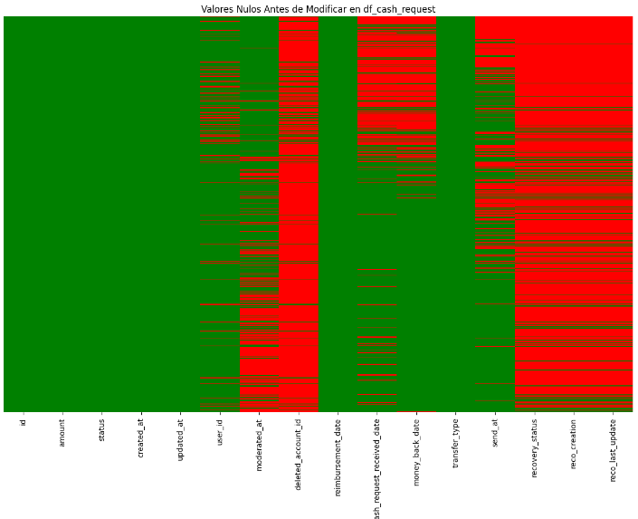
<p align="center"><b>Figure 1</b>

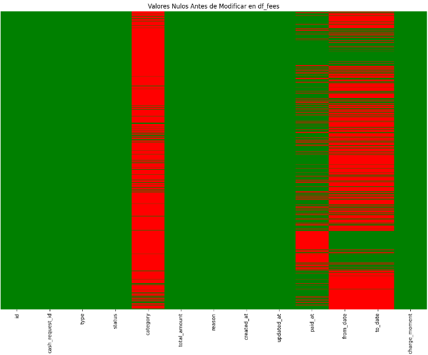
<p align="center"><b>Figure 2</b>

### - Data Types

Both datasets contain object and integer types of data, in order to facilitate furture analysis, we have transformed datas with the date&time format into datatime type in Python. The operation shows as following:

                df_fees[["created_at", "updated_at", "paid_at", "from_date", "to_date"]] = 
                    df_fees[["created_at", "updated_at", "paid_at", "from_date", "to_date"]].apply(pd.to_datetime, format="ISO8601")

### - Data Cleaning

Handling Missing Values:

To address missing data in the above datasets, we have developed a strategy of replacing the empty cells with relevant data accordingly. As for cash request dataset, we have imputed the combination of 'status' and 'transfer_type' into the missing cells; and for fees dataset, missing cells are filled in depending on its 'type' and 'category' - if the missing cell is missing due to unapplicable condition, the cell is filled in with "not applicable"

For detailed imputation process, please check *[NoteBooks\3_DataCleaning.ipynb]*


## **Exploratory Graphic Analysis for Cash Request Dataset**

- Summary Statistics

    Dataset has in total 23970 rows, representing users who had requested cash with IronHack Paymnets from 2019-11-19 until 2020-11-01.
    2020-10 has the most users who made their 1st transaction with the company. 
    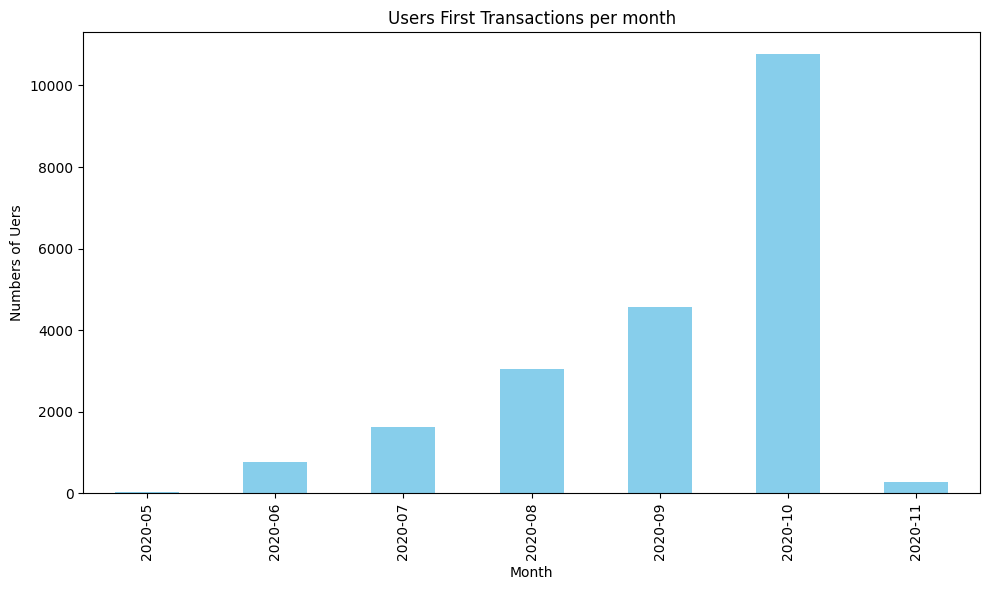

- Distribution Plots

    - Distrubution of Different Status of Cash Request Types
    

    - Line Chart for Request Frequency per Month
    


## **Exploratory Graphic Analysis for Fees Dataset**

- Summary Statistics
    
    Dataset has in total 21061 rows, representing the fees added per cash request, from 2020-05-29 until 2021-02-10.
    4 fees have missed data in cash_request_id;
    1 fee is 10 euros while the rest are 5 euros fixed fee;

- Distribution Plots

    - Bar Plot of Fee types
    

    - Distribution of Fee Status
    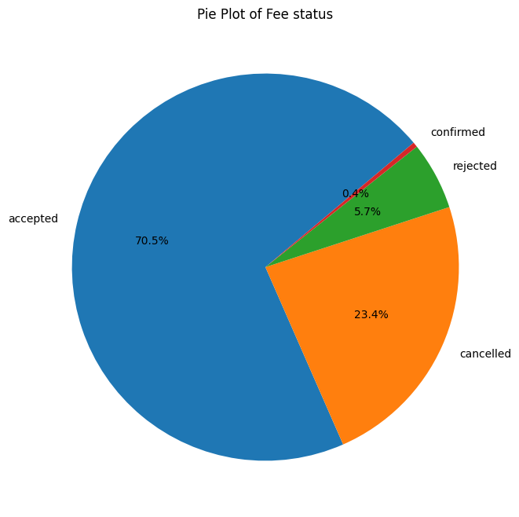

    - Fees Transaction Frequency by Started_Date
    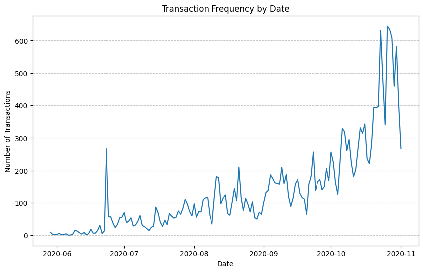

    - Proportion of Fees Transaction Categories
    


## Visualizations of Relation between Two Datasets

- Charts and graphs

    - Comparison of Fee Transaction and Cash Request Status
    

    - Comparison of Fee Transaction and Cash Request Frequency per Month
    


# *Metrics analysis
This part provides an analysis of customer in different rates for Ironhack's payment services from November 2019 to November 2020. The analysis is based on a cleaned dataset stored in a designated folder, which is used for calculating and examining various metrics.

## 1.Retention rate
### Retention Rate Analysis

The purpose of this analysis is to determine the retention rate of different customer groups. The retention rate is defined as the percentage of users who continue using Ironhack's payment services over the specified period. The customer groups are categorized based on the month the user made their first cash request from novembre 2019-2020.


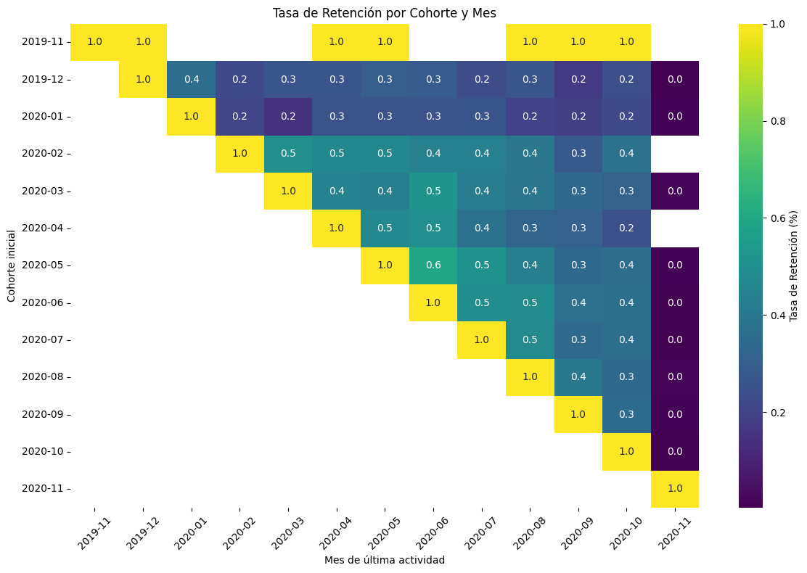

### Key Observations
1. **Retention and Acquisition Rates**:
   - The horizontal rows in the table explain the retention rate.
   - The diagonal entries represent the acquisition rate.

2. **Retention Rate by Cohort**:
   - The analysis reveals that short-time users exhibit a higher retention rate compared to the initial users analyzed.

3. **Increased Activity**:
   - A notable increase in activity was observed during the months of June, July, and August.
   - Further investigation is required to identify the factors that contributed to this surge in activity during these months.

### Conclusion

This analysis helps in understanding the retention dynamics of different customer groups and highlights periods of increased user engagement. The findings can be used to inform strategies aimed at improving customer retention and identifying potential drivers of user activity.

## 2.Incident rate
### Incident Rate Analysis

The purpose of this analysis of the incident rate is fee-relate issues encountered during cash requests within Ironhack's payment services. The analysis aims to understand the types and frequency of incidents and their correlation with cash request volumes.
Incidents in this context refer to issues such as rejected direct debits or delays in monthly payments.

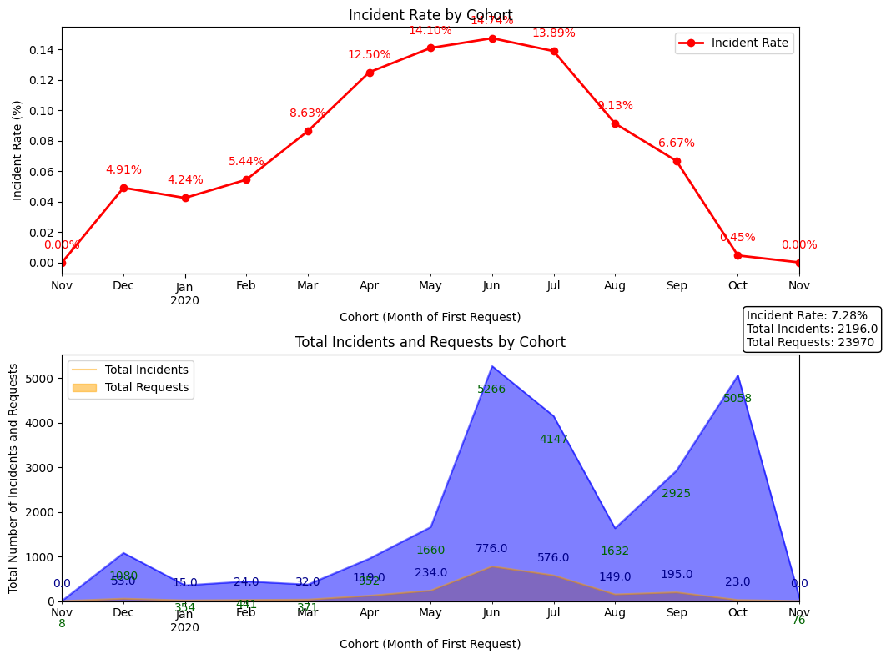

### Key Observations

1. **Incident Rate Trends**:
   - The incident rate is depicted on the first line diagram, showing the relationship between the number of cash requests and the frequency of incidents.
   - Initially, the incident rate increases in proportion to the number of cash requests until August.

2. **August Trend Reversal**:
   - In August, despite an increase in cash request demand, there is a noticeable decrease in incidents.
   - This decline in incidents amidst rising demand suggests that changes were made to reduce the incidents.
   
  

3. **Heatmap Analysis**:
   - The same trend can be detected in the heatmap, which shows the increment of incidents in the first month.
   - The heatmap visualizes the distribution and intensity of incidents over time, highlighting june,july and august.After then the incidents fall while the cash request increases.


### Conclusion

The initial impression of the analysis would indicate a direct correlation between the volume of cash requests and the incident rate. However, upon further examination, it shows that they are not correlated, as incidents decrease while cash requests increase.

## 3.Income by cohort
### Revenue Analysis

This analysis provides an in-depth analysis of the revenue generated from Ironhack's payment services. We have defined revenue as the commissions with a status of "accepted" and "confirmed" to exclude invalid data.The aim of this analysis is to understand the activity of different cohorts, identify trends, and pinpoint key moments of revenue generation.

· To filter the desired data, we used the following code:
```python
fees_df = fees_df[~fees_df['status'].isin(['rejected', 'cancelled'])]
```
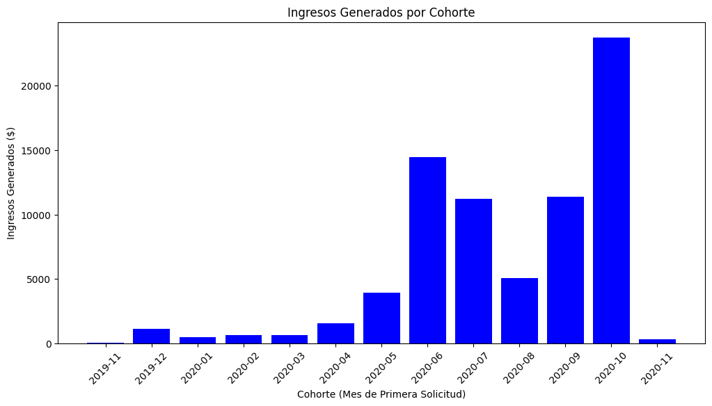

### Key Observations from the Bar Chart

- **Notable revenue results in June 2020 and October 2020.**
- **Significant decline in August 2020.**
- **Very low volume from November 2019 to April 2020, due to the lack of commission implementation.**

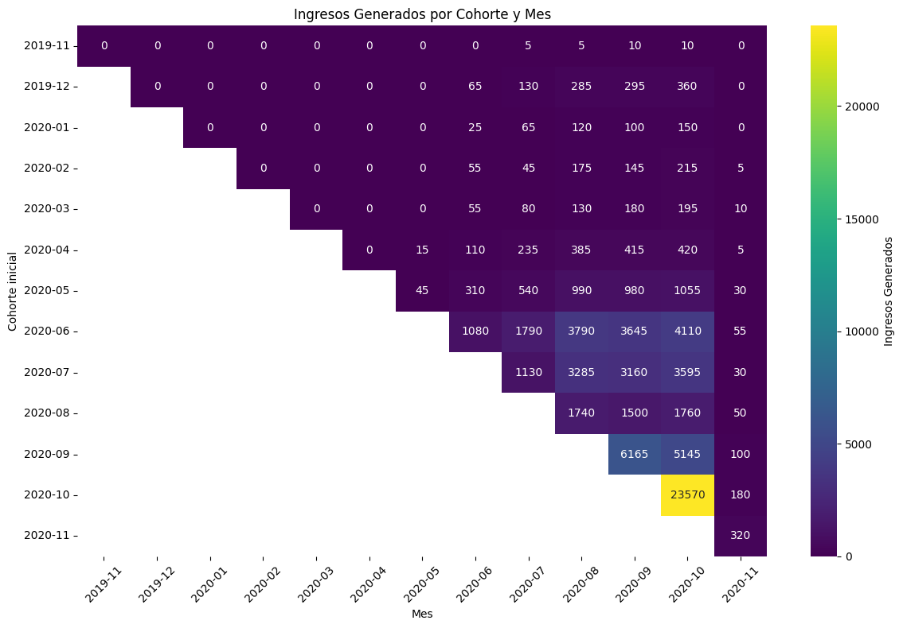

### Heatmap Analysis

To delve deeper, we created a heatmap representing the revenue movement generated by each cohort per month:

1. **Overall Trend**:
   - There is a general increase in revenue, with most cohorts showing growth in their earnings.

2. **High-Revenue Cohorts**:
   - Cohorts from June 2020, July 2020, and September 2020 have notably high revenues. Identifying the users in these cohorts is crucial as they are loyal customers with significant value.

3. **Significant Growth in May 2020 Cohort**:
   - The May 2020 cohort has an even point where the fees start generating income.

4. **Significant Period**:
   - The income starts increasing in August after a decline, reaching its maximum value in October and generating the highest income.

### Correspondence with Incident Rate

The revenue graph aligns with the increased activity shown in the incident rate table, where activity is compared with the number of incidents.

### Conclusion

This analysis highlights the importance of tracking cohort-specific revenue and understanding the factors driving their performance. Identifying key cohorts and their characteristics can help in strategizing for better customer retention and revenue growth.

## 4.New metrics
### 4.1 **Incident Rate by Loan Type and Status**

In this section, we delve deeper into the incident rate observed in October 2020, aiming to investigate the cause and impact on the business. We analyzed the incident rate using months as cohorts and created graphs based on loan type (regular or instant) and loan status (accepted, rejected, cancelled, & confirmed). The goal is to identify which elements contribute most to the incident rate and how they affect revenue and the business's reputation.

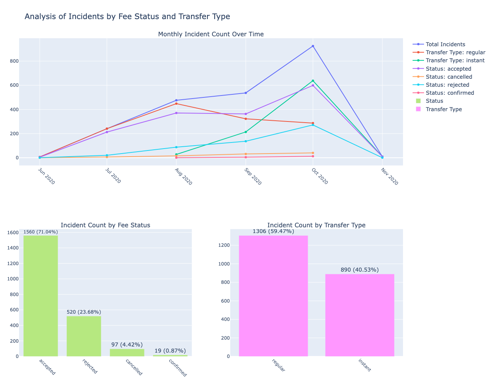

### Key Observations

1. **Overall Incident Rate**:
   - The incident rate showed a notable increase starting in June 2020, with a peak in October 2020.
   - Among the two loan types, "Regular" loans cause more incidents than "Instant" loans. The incident rate for "Regular" loans increased significantly from August 2020 to October 2020, suggesting a need to study and improve this loan type to reduce the incident rate.
   - In October 2020, there was an unprecedented number of "rejected" commissions and a significant decrease in "confirmed" commissions. This requires further investigation to determine whether it was due to a policy change or a system failure.

2. **Impact on Revenue and Business Image**:
   - The increase in incidents from June 2020 and the peak in October 2020 had a noticeable impact on the business.
   - The higher incident rate in "Regular" loans indicates potential issues that need addressing to maintain business image and customer satisfaction.

### Conclusion

Understanding the trends and causes of incidents, particularly in the "Regular" loan category, is crucial for improving service quality and maintaining a positive business reputation. Further investigation into the high number of rejected commissions in October 2020 is necessary to identify and rectify underlying issues.


### 4.2 Analysis of the Relationship Between Transfer Type and Income Generated

This section analyzes the relationship between monthly income and loan activities. The goal is to understand how different loan types and loan activity levels influence revenue generation.

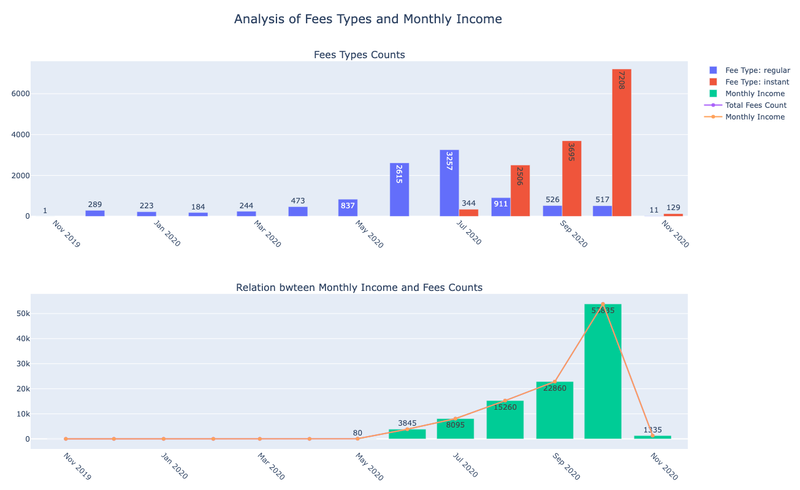

### Key Observations

1. **Impact of Instant Loans**:
   - The introduction of instant loans in May 2020 contributed positively to generated income, indicating that this service was well-adapted by clients.

2. **Positive Correlation**:
   - There is a positive correlation between loan activity and monthly income. The increase in loan requests starting in June 2020 had a direct impact on revenue.

3. **October 2020 Income Peak**:
   - In October 2020, we experienced a peak in income. This suggests that the company may have organized an event or activity that boosted user engagement and, consequently, revenue.

### Conclusion

Understanding the relationship between loan activities and monthly income is crucial for optimizing business strategies. The positive impact of instant loans and the correlation between increased loan activity and revenue highlight the importance of adapting services to meet client needs and leveraging user engagement activities to boost income. Monitoring these trends will help in making informed decisions for future growth and revenue generation.

### 4.3 **Monthly Financial Analysis**

This section details the calculation and visualization of monthly loan amounts and fee incomes, including efficiency metrics per dollar lent. After gaining insights into monthly loans and incomes, we began to evaluate the efficiency of our business in generating revenue. Business efficiency is defined as the percentage of income generated for every 1% of capital lent.

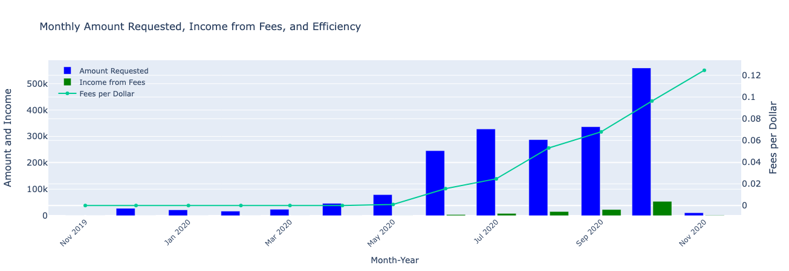

### Key Observations

1. **Positive Trend in Income Efficiency**:
   - There is a notable positive trend in the income generated per dollar lent, with the peak appearing in the last month of the dataset.

2. **Sharp Increase from May 2020**:
   - Starting in May 2020, there is a sharp increase in efficiency, indicating that the company has become more effective in utilizing capital to generate income from this month onward.

3. **High Levels in October 2020**:
   - October 2020 shows both high amounts of money lent and high income generated. It would be beneficial to investigate the strategies employed in this month and the previous month to replicate their success in the future.

### Conclusion

Understanding the efficiency trends and the factors contributing to peak performance months can help in formulating strategies that enhance revenue generation. This analysis underscores the importance of continual monitoring and optimization of business processes to maintain and improve efficiency in capital utilization.

## **Conclusion**

### Key findings

**· Retention rate:** 
notable increase in activity was observed during the months of June, July, and August.
Further investigation is required to identify the factors that contributed to this surge in activity during these months.

**· Incident rate:** the distribution and intensity of incidents over time, highlighting june,july and august.After then the incidents fall while the cash request increases. On May was included the instant payment.

**· Income by cohort:** Cohorts from June 2020, July 2020, and September 2020 have notably high revenues. Identifying the users in these cohorts is crucial as they are loyal customers with significant value. The income starts increasing in August after a decline, reaching its maximum value in October and generating the highest income.

**· Incident Rate by Loan Type and Status:** Among the two loan types, "Regular" loans cause more incidents than "Instant" loans. The incident rate for "Regular" loans increased significantly from August 2020 to October 2020, suggesting a need to study and improve this loan type to reduce the incident rate.Furthermore on October 2020, there was an unprecedented number of "rejected" commissions and a significant decrease in "confirmed" commissions. This requires further investigation to determine whether it was due to a policy change or a system failure.

**· Analysis of the Relationship Between Transfer Type and Income Generated:** The introduction of instant loans in May 2020 contributed positively to generated income, indicating that this service was well-adapted by clients.

**· Monthly Financial Analysis:** There is a notable positive trend in the income generated per dollar lent, with the peak appearing in the last month of the dataset.
Starting in May 2020, there is a sharp increase in efficiency, indicating that the company has become more effective in utilizing capital to generate income from this month onward.


- Conclusion

We can conclude that the company has experienced an increase in retention, particularly during the months of June, July, and August. This period also saw a rise in activity, which correlated with an increase in incidents. However, the incidents are not directly related to the increase in activity, as a future scenario shows that an increase in activity can lead to a decrease in total incidents. These incidents could involve money or debit issues.

In terms of revenue, it is evident that the company has increased its income since the incorporation of instant payments. The instant payment service has proven to be highly beneficial for the enterprise, as its implementation has significantly boosted revenue. Despite the increase in incidents associated with this new payment method, the overall revenue has grown substantially compared to regular payments.

The same positive impact is demonstrated in the ROI per dollar lent. There is a notable positive trend in the income generated per dollar lent, with the peak appearing in the last month of the dataset. Starting in May 2020, there has been a sharp increase in efficiency, indicating that the company has become more effective in utilizing capital to generate income from this month onward.

In summary, the introduction of instant payments has been advantageous for the company, enhancing both revenue and efficiency, despite the accompanying increase in incidents. This suggests that further focus on optimizing instant payments and mitigating related incidents could drive even greater business success.


#Analysis of the group flow

Reflect and what helped you move forward, what held you back. Cherish what made you feel great, and anticipate future risks.

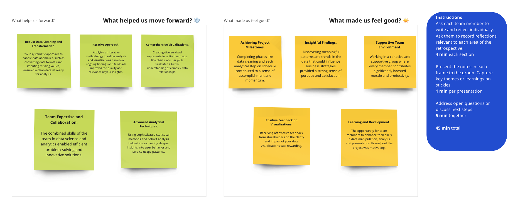
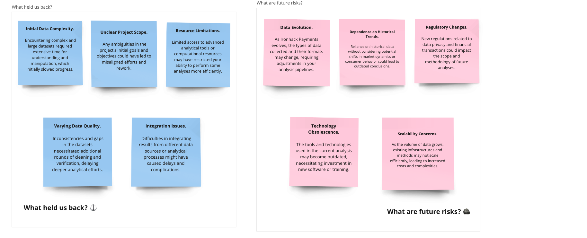


